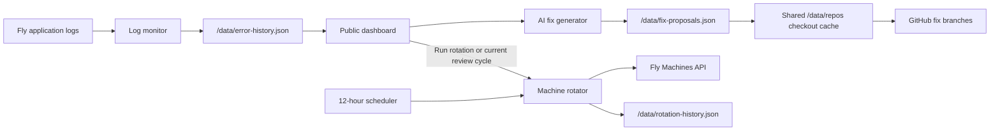
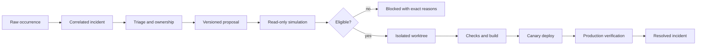

# Fly Machine Rotator Production Design and Workflow Simulation

Updated: 2026-07-13

Status: evidence-backed design audit; no production repair, repository write, push, deploy, or Machine rotation was performed for this simulation

## Purpose

This document describes what the rotator actually does today, what the current live repair queue would do if its bulk actions were invoked, and the work required to make the rotator a reliable application-maintenance system.

The intended product has two related but separate responsibilities:

1. Observe, classify, propose, test, deploy, and verify fixes for application incidents.
2. Refresh Fly Machines without losing traffic or persistent state.

Those responsibilities must share telemetry and audit records, but they must not trigger one another implicitly.

## Production Rules

The workspace runtime policy applies to every rotator-managed app:

| Value | Production location |
| --- | --- |
| Secrets, provider credentials, GitHub credentials, Fly credentials | Environment/Fly secrets only |
| Public URLs, app lists, thresholds, feature flags, and rotation policy | Volume-backed versioned runtime JSON |
| Users, incidents, proposals, workflow runs, app state, and audit history | Database |
| Media and large durable files | Object storage where practical |
| Rebuildable caches and temporary output | Per-Machine ephemeral storage |
| Local development overrides | Gitignored local environment only |

Do not replicate secret-bearing JSON between volumes. Several ecosystem apps still store tokens or account state in volume JSON; those stores must be classified and migrated before replicated high-availability rotation is safe.

## Current Deployed Shape

The deployed app is `mtman-machine-rotator`. The authoritative source at this snapshot is this repository on `main` at commit `0acfc5e`, matching `origin/main`.

The rotator also hosts MountainView. The maintenance engine and MountainView should eventually have separate route modules, authorization scopes, state tables, and readiness checks even if they continue sharing one Fly app to control cost.

## What The Current Buttons Actually Do

### Run AI review cycle

The current review cycle is not a read-only review or a generation-only operation. It performs these operations in order:

1. Adds ignore rules for messages recognized as known noise.
2. Removes matching events from current error history.
3. Runs a real rotation across every configured app.
4. Updates the Discord report.
5. Generates or refreshes a proposal for every remaining unique app/fingerprint pair.

This coupling is unsafe and surprising. Generating fixes must never restart applications.

### Generate fix or Refresh fix

For one error card, the rotator:

1. Maps the Fly app name to one of four repositories.
2. Reuses or clones a repository into `/data/repos`.
3. Fetches/pulls the checkout only when it is clean and only on its current branch.
4. Selects up to ten source files using hard-coded paths plus keyword search.
5. Sends the error, recent log context, previous attempts, related records, and source excerpts to Eden AI, then OpenAI, then Gemini as fallbacks.
6. Requests full replacement content for every changed file.
7. Keeps changes only when the file exists and passes basic path/truncation checks.
8. Calculates a heuristic confidence score and stores the proposal.

A diagnosis-only local fallback is recorded as `generated` even when it has no file changes. That makes the queue look more complete than it is.

### Approve and apply

For one proposal, the rotator:

1. Requires a repository mapping and at least one full-file replacement.
2. Refuses a dirty checkout or a proposal whose stored HEAD differs from the checkout HEAD.
3. creates/resets a fix branch from whichever branch is currently checked out;
4. writes full file contents into the shared `/data/repos` checkout;
5. records the proposal as applied.

It does not automatically restore the checkout if the patch or later checks fail.

### Run checks

The rotator installs dependencies in the long-running production rotator Machine and runs only `npm run typecheck` for the mapped repository. If checks pass and a `GITHUB_TOKEN` exists, the current default can push the branch unless either push flag is explicitly set to `false`. This makes the separate `Push branch` button misleading.

### Run auto-fix cycle

The current auto-fix cycle:

1. Runs the entire review cycle, including a real Machine rotation.
2. Iterates over every active event.
3. Applies any proposal containing a change, regardless of its quality-gate verdict or confidence.
4. Runs the repository's typecheck.
5. May push the branch.

It does not build a conflict graph, batch one root cause, reset to fresh `origin/main` between fixes, use isolated worktrees, run app-specific tests/builds, deploy a canary, or roll back a failed production verification.

## Read-Only Simulation Results

### Observed live queue

The dashboard is a rolling 24-hour window, not a count of independent bugs.

| Observation | Result |
| --- | --- |
| Initial public report | 43 recorded events |
| Initial dashboard | 33 unique app/fingerprint review targets |
| Later snapshot at 2026-07-13 15:40 UTC | 30 events and 30 targets |
| Later snapshot during classification | 27 events and 27 targets |
| Production mutation caused by this audit | None; older events crossed the 24-hour cutoff |

The count decreased without a repair because events aged out. The UI needs separate counters for occurrences, open incidents, suppressed events, resolved incidents, and expired observation-window entries.

The final 27-event sample represented far fewer root causes:

- Multiple HMO DJ worker lines came from the same FFmpeg/HLS conversion attempts: invalid `hls_delete_threshold`, output initialization, missing segment directories/files, and wrapper-level conversion failures.
- Two malformed JSON payloads were logged by four apps, producing multiple cards for a shared or replayed input failure.
- Two Discord message-update errors described the same transient upstream `503` failure.
- One StreamWeaver Discord webhook creation request returned `404`.
- One YouTube input had no resolvable audio stream.

Exact-fingerprint deduplication is therefore insufficient. The system needs causal incident correlation across process addresses, request IDs, payload positions, wrapper errors, apps, and time windows.

### Proposal-store simulation

The volume contained:

| Proposal evidence | Count |
| --- | ---: |
| Stored proposal records | 57 |
| Status `generated` | 27 |
| Status `error` | 29 |
| Status `handled` | 1 |
| Records with one or more file changes | 19 |
| Total full-file change objects | 22 |
| Records with checks ever run | 0 |
| Records with successful pushes | 0 |
| Records with post-deploy verification | 0 |
| Recorded successful generation attempts | 30 |
| Recorded failed generation attempts | 42 |

At the 30-target snapshot, only three active targets had proposal records. Two were five-percent-confidence local fallback diagnoses with zero changes, and one was an error with zero changes. The bulk apply simulation therefore had zero currently eligible file changes and would count every active target as a failure or no-change case.

Historical provider evidence included eight OpenAI `429` responses and eight Gemini `400` responses. Seven stored records explicitly used the local fallback. Provider success does not imply patch correctness; it only means parseable output reached the proposal normalizer.

### Repository-freshness simulation

The four cached production checkouts were clean, but behind the canonical `main` commits in this workspace:

| Repository | Rotator cache HEAD | Current `main` HEAD |
| --- | --- | --- |
| DiscordStreamHub | `f4b6810e1d97` | `ab05436f6724` |
| HearMeOut | `bcb7ae6aea2b` | `ee3c9e129e21` |
| ChatTag | `f75e3cc01ee0` | `284a7c2b57a2` |
| StreamWeaver | `5bad4e8e022b` | `1bd5cbb22293` |

Seven of the 22 historical change objects referenced paths that did not exist in the current cached checkout. Existing staleness protection would correctly reject a mismatched HEAD at apply time, but the dashboard does not explain staleness until after the operator clicks apply.

### Current bulk-apply behavior simulation

Even if generation produced changes for every target, the current loop cannot safely apply several fixes to one repository:

1. All proposals for a repository are generated from one starting HEAD.
2. The first proposal checks out a fix branch and changes the shared checkout.
3. Without a push, the checkout is dirty, so the next proposal is rejected.
4. With a push, HEAD advances to the first fix commit, so the next stored snapshot is stale and is rejected.
5. If two proposals touch the same file, no conflict or dependency analysis occurs before the first write.

The practical maximum is usually one applied proposal per repository per cycle, and even that proposal has not yet been proven by the live history.

### Existing automated checks

Local verification on 2026-07-13 passed:

- TypeScript typecheck.
- 9 Vitest files.
- 59 tests.

The tests correctly cover the basic standby-before-stop handoff, unhealthy standby protection, volume restart fallback, path traversal protection, likely truncation protection, provider JSON extraction, scheduler timing, and reporting.

They do not cover:

- Dashboard authentication or CSRF.
- Generate-all behavior.
- Auto-fix quality gating.
- Full generate/apply/check/push/verify transitions.
- Several proposals for one repository.
- Checkout cleanup and rollback after failure.
- Stale `origin/main` before generation.
- Provider redaction, secret scanning, or malicious output.
- Real app tests/builds and canary deploys.
- Incident correlation or ignore-rule false positives.
- Two-volume replication and promotion.

## What The Current Design Gets Right

### Repair workflow

- The app maps Fly app names to explicit repositories rather than asking the model to invent a repository.
- It collects source context and records the commit used during generation.
- It rejects path traversal and blank/obviously tiny full-file replacements.
- It refuses to apply when the checkout is dirty or HEAD changed.
- It records attempts, check output, push metadata, verification state, and quality signals in one proposal record.
- It uses branches instead of intentionally pushing directly to `main`.
- Its local fallback refuses to invent code when model providers are unusable.

### Rotation workflow

The volume contained 20 rotation runs and 140 app results:

| Rotation outcome | Count |
| --- | ---: |
| Successful app results | 137 |
| Failed app results | 3 |
| Non-volume standby handoffs | 42 |
| Volume-preserving in-place restarts | 96 |
| No-op results | 2 |

The current rotator:

- Acquires a Fly Machine lease before normal handoff and restart operations.
- Starts and health-checks a non-volume standby before stopping the old Machine.
- Leaves the old Machine running when a standby never becomes healthy.
- Uses stop/start on a volume Machine, which preserves the mounted volume while resetting the ephemeral root filesystem.
- Retries known transient start failures.
- Avoids cloning an active attached volume onto a second Machine.
- Records before/after IDs, actions, warnings, failures, and scheduling history.

These are valuable foundations. They are not yet zero-downtime stateful rotation.

## Production Blockers

### P0 — Secure the control plane before adding bulk apply

1. `authorizeAction()` is currently a no-op. Every dashboard POST action is effectively open even though an action-token secret exists.
2. The dashboard and downloadable logs expose error details and generated full-file contents without an authenticated owner session.
3. There is no CSRF protection, action-level role/scope check, rate limit, or tamper-evident audit record.
4. Authenticated repository URLs are persisted in the volume checkout's Git remote configuration, placing the GitHub token outside the secret store.
5. Source and log context is sent to external AI providers without a redaction or secret-scanning gate.

Required outcome:

- Use SPMT owner/admin authentication with short-lived server-side sessions and action-specific scopes.
- Require CSRF protection for browser actions and an idempotency key for every mutation.
- Keep public status separate from private logs, proposals, source, and controls.
- Use a short-lived GitHub App installation token or credential helper; never persist credentials in `.git/config`.
- Redact tokens, cookies, authorization headers, emails/identifiers where not required, URLs with credentials, and environment values before any provider request.
- Explicitly keep auto-fix and fix-branch push disabled until all P0 gates pass. These are public operational toggles and belong in versioned runtime config, not secrets.

### P0 — Decouple review from rotation

Replace the current review-cycle endpoint with separate commands:

- `Collect now`: sample logs only.
- `Triage`: correlate events into incidents and classify them.
- `Generate proposals`: read source/provider operation only.
- `Simulate eligible fixes`: isolated, no repository or production mutation.
- `Apply eligible fixes`: isolated branch/worktree operation.
- `Rotate apps`: explicit Machine lifecycle operation.

No repair button may restart an application unless the displayed execution plan explicitly includes a post-deploy restart and the operator grants that separate permission.

### P0 — Make ignore and handled state non-destructive

Current ignore and handled operations remove records from error history. A handled action removes by fingerprint without also requiring the app name, so a shared fingerprint can remove events belonging to another app.

Replace deletion with append-only dispositions:

- `suppressed` with scope, reason, owner, created time, expiry, and matching preview.
- `duplicate-of` with canonical incident ID.
- `external/transient` with retry policy.
- `resolved` with fixing commit/deploy and verification evidence.
- `false-positive` with rule-version feedback.

Raw events remain immutable for retention, audit, and classifier evaluation.

### P1 — Replace confidence theater with enforceable eligibility

The present quality score is based mainly on the model's label, number of changes, whether typecheck ran, and whether a branch/verification record exists. The auto-fix loop does not enforce its verdict.

An auto-eligible proposal must pass deterministic gates:

1. Incident classified as code-owned and reproducible.
2. Repository and deployed commit mapped exactly.
3. Proposal generated from fresh `origin/main`, not the cache's current branch.
4. Isolated clean worktree/container created for the incident batch.
5. Unified diff applies cleanly with bounded files/lines.
6. No secret, dependency, workflow, infrastructure, schema, auth, billing, or destructive-data change unless separately approved.
7. Syntax/format checks pass.
8. Targeted regression test is added or an existing test proves the failure and fix.
9. Repository typecheck, lint, tests, and production build pass.
10. App-specific contract and smoke tests pass.
11. Rollback commit/image and database migration plan exist.
12. Canary deploy passes readiness and observation window.

Model confidence is supporting evidence only; it never grants permission.

### P1 — Stop replacing full files

Store and apply reviewable patches with:

- Base blob SHA and target path.
- Minimal unified diff/hunks.
- Changed-line count and semantic summary.
- Test diff.
- Provider/model/prompt version.
- Source evidence citations.

Reject unexpected whole-file rewrites. The current truncation threshold can still allow a large file to lose most of its content.

### P1 — Isolate repository execution

Each repository batch needs a disposable workspace created from fresh `origin/main`:

1. Fetch current remote refs using a short-lived read token.
2. Create one worktree/container per repository incident batch.
3. Apply compatible proposals in dependency order.
4. Install from the lockfile with lifecycle/network policy appropriate to the repo.
5. Run checks with CPU, memory, time, disk, and network limits.
6. Produce artifacts and a signed result manifest.
7. Destroy the workspace after push or failure.

Never run untrusted generated code or package lifecycle scripts inside the long-running control-plane Machine.

## Target Incident And Repair Model

### Data model

Minimum durable records:

- `raw_event`: immutable app, Machine, timestamp, source, sanitized message, encrypted raw reference, correlation IDs.
- `incident`: normalized signature, recurrence, severity, classification, owner, affected apps, canonical root cause.
- `disposition`: suppressed, duplicate, transient, config, provider, code, resolved, reopened.
- `proposal`: base commit, patch, tests, rationale, provider provenance, deterministic gate results.
- `execution`: isolated workspace, commands, outputs, artifacts, resource use, failure stage.
- `release`: branch/PR, commit, image, deploy, canary, rollback target.
- `verification`: health, contract checks, recurrence window, metrics comparison.
- `audit`: actor, action, scope, idempotency key, before/after state.

### Generate all

`Generate all` should mean “generate or refresh proposals for all triaged code incidents,” not all log lines.

The preview must show:

- Incident count and occurrence count.
- Code/config/external/transient/noise classification.
- Repository and base commit.
- Provider cost/token estimate.
- Incidents that will be skipped and why.
- No Machine rotation or repository mutation.

### Apply all

Rename the action to `Apply all eligible fixes`.

Before confirmation, display:

- Eligible proposal count.
- Blocked proposal count with exact gates.
- File conflicts and dependency ordering.
- Planned repository batches and branches.
- Commands and time budgets.
- Whether a branch, PR, staging deploy, canary, production deploy, or restart is authorized.

Apply proposals per repository, serially within a dependency graph and in parallel only across independent repositories. The default stopping rule is fail-closed: one failed deterministic gate blocks that proposal and any dependent proposals without corrupting the batch.

## Machine And Volume Rotation

### Current live topology

| App | Machines | Running | Stopped standby | Volumes | Attached | Unattached |
| --- | ---: | ---: | ---: | ---: | ---: | ---: |
| `chat-tag-bot-new` | 1 | 1 | 0 | 0 | 0 | 0 |
| `chat-tag-new` | 1 | 1 | 0 | 2 | 1 | 1 |
| `discord-stream-hub-new` | 1 | 1 | 0 | 1 | 1 | 0 |
| `dsh-clip-worker` | 2 | 1 | 1 | 0 | 0 | 0 |
| `hearmeout-main` | 1 | 1 | 0 | 1 | 1 | 0 |
| `hmo-dj-worker` | 1 | 1 | 0 | 3 | 1 | 2 |
| `streamweaver-new` | 1 | 1 | 0 | 1 | 1 | 0 |

The unattached ChatTag and HMO volumes are not automatically current replicas and must not be promoted based only on their existence.

### Why a proxy volume is not the right primitive

A Fly Volume is local block storage on one server. A Machine can mount one volume, a volume can attach to one Machine, and separate volumes are not replicated automatically. Fly Proxy routes network traffic; it does not proxy block-volume reads and writes.

A service that “proxies into the real volume” would become a network database or object-storage service with the original volume as a single point of failure. Use a database/object store directly instead of inventing a filesystem proxy.

Official references:

- <https://fly.io/docs/volumes/overview/>
- <https://fly.io/docs/reference/fly-proxy/>
- <https://fly.io/docs/reference/health-checks/>
- <https://fly.io/docs/machines/api/machines-resource/>

### Recommended default: externalize canonical state

For the simplest reliable two-Machine handoff:

1. Move users, messages, configuration state, game state, queues, and workflow state to the owning app's database.
2. Move durable clips, generated media, HLS source assets, and uploads to object storage where practical.
3. Keep only rebuildable caches and temporary files on each Machine.
4. Keep public runtime config in versioned volume-backed JSON and synchronize it through a controlled checksum/version process before promotion.
5. Keep all secrets in Fly secrets/env; remove tokens from volume files.
6. Run one active and one stopped or cordoned standby from the same image/config.
7. Start the standby, run deep readiness, uncordon/register it, drain the active Machine, then stop the old Machine.

With canonical state externalized, each Machine's local filesystem can be safely refreshed without copying a volume.

### If SQLite must remain on Fly Volumes

Two Machines require two volumes and an application/database replication protocol. The standby cannot remain powered off indefinitely and still be assumed current.

A safe promotion needs:

1. Two independent volumes, preferably in separate hardware zones.
2. Continuous or explicitly verified replication.
3. One write-primary lease/fencing mechanism.
4. Replication-lag and checksum readiness gates.
5. Promotion of the caught-up replica before traffic or worker leadership moves.
6. Demotion/fencing of the old primary before it can write again.
7. Off-platform backups and a tested restore.

LiteFS is one SQLite replication option, but Fly's documentation warns not to combine it with autostop/autostart and notes its support limitations. For this ecosystem, managed Postgres plus object storage is the lower-risk production target unless an app-specific SQLite constraint justifies LiteFS operational complexity.

References:

- <https://fly.io/docs/litefs/>
- <https://fly.io/docs/litefs/getting-started-fly/>

### Target blue/green rotation state machine

For stateless or externally stateful HTTP apps:

1. Acquire a durable per-app rotation lease and idempotency key.
2. Fetch fresh Machine configuration; never act from cached configuration.
3. Confirm the intended active/standby pair, image, region, services, and state ownership policy.
4. Start the standby while it is cordoned/unregistered where supported.
5. Run liveness, deep readiness, database connectivity, migrations, dependency, and app-specific smoke checks.
6. Confirm background workers are fenced and cannot duplicate work.
7. Register/uncordon the standby and wait for Fly Proxy service health.
8. Drain HTTP/WebSocket/queue work on the active Machine with a deadline.
9. Transfer leader/worker lease where applicable.
10. Stop the old Machine and verify its ephemeral filesystem will reset on next start.
11. Verify exactly the intended capacity, not always exactly one Machine.
12. Record state, metrics, result, and rollback instructions.

For a replicated-volume app, insert replica catch-up, write fencing, promotion, and consistency verification before step 7.

### Rotation-policy changes required

- Replace the global “exactly one running” invariant with per-app desired capacity and role policy.
- Replace `ALLOW_MULTI_MACHINE_SERVICES` with explicit app policy; the current flag allows the app through initial checks but the final verifier still stops extras.
- Set `REQUIRE_HEALTH_CHECKS=true` after every managed service has a truthful readiness endpoint.
- Distinguish HTTP apps, singleton workers, replicated workers, volume-primary apps, and cache-only volume apps.
- Do not treat every mount as canonical state. HMO HLS/music caches need a different policy from DSH SQLite or StreamWeaver tenant/account state.
- Store rotation policy in versioned public runtime config with schema validation and audit.
- Add maximum-unavailable, drain timeout, replication lag, and automatic rollback settings per app.

## Implementation Roadmap

### Phase 0 — Freeze unsafe automation

1. Keep auto-fix execution and automatic branch push explicitly disabled.
2. Add an operator banner explaining that review currently rotates apps.
3. Stop exposing private logs/source/proposals publicly.
4. Rotate the GitHub credential after removing it from cached Git remote URLs.
5. Back up the rotator volume and database; prove an isolated restore.

Exit: no unauthenticated mutation or credential persistence remains.

### Phase 1 — Secure and separate commands

1. Add SPMT owner/admin auth, scopes, CSRF, rate limits, idempotency, and audit.
2. Split collect, triage, generate, simulate, apply, deploy, verify, and rotate endpoints.
3. Move operational state from scattered JSON into database tables.
4. Preserve raw events; migrate existing ignore rules into non-destructive dispositions.
5. Make current feature flags explicit public runtime config.

Exit: every action has one purpose and an authenticated, auditable actor.

### Phase 2 — Incident correlation and truthful queue

1. Normalize dynamic IDs, process addresses, timestamps, payload positions, and wrapper prefixes.
2. Correlate nested/wrapper log lines into one incident.
3. Correlate the same request/cause across apps.
4. Classify code, config, credentials, user input, external provider, transient platform, and expected noise.
5. Add occurrence/open/resolved/suppressed counters and severity.
6. Add recurrence/SLO views rather than relying on a rolling event count.

Exit: the 43-event sample is represented as its smaller set of actionable incidents with evidence.

### Phase 3 — Deterministic proposal simulation

1. Generate from fresh `origin/main` with sanitized context.
2. Store minimal patches and tests, not full-file replacements.
3. Add repository/commit/path/diff/secret/dependency/schema/auth gates.
4. Build one disposable worktree/container per repository batch.
5. Run syntax, targeted regression, typecheck, lint, unit, contract, and build commands.
6. Show an execution plan for `Apply all eligible fixes` without mutation.

Exit: simulation predicts exact eligible, blocked, conflict, command, and branch outcomes.

### Phase 4 — Branch, PR, and canary automation

1. Use short-lived GitHub App tokens.
2. Create one branch/PR per coherent incident batch.
3. Attach logs, patch, tests, commands, and rollback evidence.
4. Deploy to staging/canary only after checks pass.
5. Run live feature smoke tests and observe recurrence/metrics.
6. Auto-rollback a bad canary; never mark resolved merely because the old event aged out.

Exit: a low-risk eligible batch can move from incident to verified canary without corrupting another batch.

### Phase 5 — Volume-safe Machine policies

1. Inventory every `/data` file by secret/public config/app state/blob/cache classification.
2. Remove secrets from volumes.
3. Move canonical app state to databases and durable blobs to object storage.
4. Add app-specific desired capacity, worker fencing, drain, and readiness policy.
5. Provision/test one standby for stateless/external-state apps.
6. Choose Postgres/object storage or a proven replicated-volume design for each mounted app.
7. Add promotion, consistency, failback, backup, and restore tests.

Exit: every managed app either performs a healthy blue/green handoff or is explicitly labeled single-volume/downtime-required.

### Phase 6 — Production autonomy

1. Start with advisory-only classification.
2. Enable automatic proposals for low-risk incidents.
3. Enable automatic isolated checks for eligible proposals.
4. Enable automatic canaries for a small allowlist.
5. Enable automatic production merge/deploy only after measured precision, rollback success, and tenant-isolation gates meet policy.
6. Review false positives, escaped incidents, rollback rate, and mean time to recovery every release.

Exit: autonomy is earned by evidence and can be disabled independently at every stage.

## Required Test Matrix

| Area | Required proof |
| --- | --- |
| Authentication | Anonymous, expired, wrong-role, CSRF, replay, and rate-limit requests cannot mutate |
| Incident correlation | One causal chain becomes one incident; separate tenants/causes never merge |
| Ignore rules | Preview, bounded scope, expiry, audit, undo, and no raw-event deletion |
| Provider safety | Secrets/log identifiers are redacted; provider failure degrades without fake readiness |
| Patch safety | Path traversal, symlink escape, truncation, generated files, binary files, secret additions, workflows, dependencies, migrations, and destructive APIs are gated |
| Batch apply | Same-repo conflicts, dependent fixes, independent repos, partial failure, cleanup, retry, and idempotency |
| Checks | Targeted regression, typecheck, lint, unit, contract, build, install failure, timeout, OOM, and malicious lifecycle script |
| Git | Fresh remote, stale commit, force-push, missing branch, token expiry, push rejection, and no credentials persisted |
| Deploy | Canary health, deep readiness, failed migration, rollback, recurrence, and observation window |
| Stateless rotation | Standby healthy/unhealthy, drain, WebSockets, old-machine stop failure, lease expiry, and duplicate request protection |
| Singleton workers | Leader fencing, in-flight job drain, retry, and no duplicate Discord/bot action |
| Replicated state | Lag, checksum, primary loss, split brain, stale standby, promotion, failback, and backup restore |
| Volume failure | Missing, unattached, wrong region/zone, snapshot restore, disk-full, corruption, and cache rebuild |

## Production Completion Definition

The rotator is ready to keep the ecosystem healthy only when:

1. The dashboard cannot be read or mutated without the correct SPMT owner/admin scope.
2. Raw events are correlated into truthful incidents and never deleted by ignore/handled actions.
3. `Generate all` performs no rotation or repository mutation.
4. `Apply all eligible fixes` refuses every proposal lacking deterministic proof.
5. Every proposal runs in a disposable workspace from current `origin/main`.
6. No credential is stored in a volume checkout or sent to an AI provider.
7. App-specific tests, build, canary, rollback, and recurrence verification are automatic and auditable.
8. Fixes for the same repository are conflict-planned and cannot contaminate one another.
9. Every app has a state classification and explicit rotation policy.
10. Volume apps use external canonical state, proven replication, or an honest in-place restart policy with measured downtime.
11. Desired capacity and worker leadership are verified without the global exactly-one assumption.
12. A restore and rollback game day proves that the rotator cannot turn an error into a larger outage.
